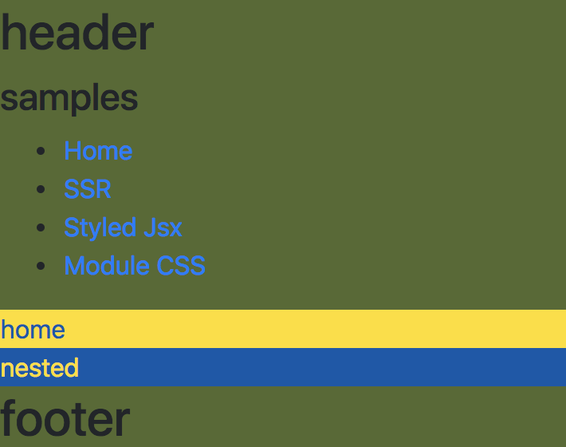

# Next.js TypeScript Starter Kit [](https://circleci.com/gh/deptno/next.js-typescript-starter-kit)



Start with sample

### Latest update
- apply next@6.1
- remove bootstrap cdn
- more examples
  - ssr
  - module css
  - style jsx
- next.js way
  -  custom _page.tsx => _app.tsx,
  

> see **[ChangeLog](CHANGELOG.md)**

## Feature
 - TypeScript
 - Styled-jsx
 - Module css **(PostCSS - cssnext, nested, import)**
 - SEO & analytics(Google Analytics, Facebook Pixel, <s>Naver Analytics</s>)
 - Storybook **(support module css)**
 - Jest & Enzyme **(support module css)**

### Packages
 - next@6.1
 - react@16.4
 - redux-thunk
 - react-ga
 - redux-persist@4

### Load from CDN
 - font-awesome@5

## Installation

```sh
git clone https://github.com/deptno/next.js-typescript-starter-kit my-project
cd my-project
rm -r .git
npm install
```

## Run :rocket:

#### :rocket: Test
```bash
npm run test # test
npm run test:watch
npm run test:coverage # report coverage
```

#### :rocket: StoryBook
```bash
npm run storybook # open browser localhost:6006
```

```bash
npm run build-storybook # Build storybook static assets
```

### :rocket: Development

```bash
npm run start:dev # run
```

### :rocket: Production

#### Serve
```bash
npm install
npm run build # create .next directory
npm start # start server
```

#### Build static HTML
```bash
npm install
npm run build # create .next directory
npm run export # create .out directory
```

## Configuration

Set SEO & analytics variables

> src/constants/env.ts

```typescript
export const GA_TRACKING_ID = ''
export const FB_TRACKING_ID = ''
export const SENTRY_TRACKING_ID = ''

// for meta tag <og & twitter>
export const SITE_NAME = ''
export const SITE_TITLE = ''
export const SITE_DESCRIPTION = ''
export const SITE_IMAGE = ''
```

If each variable evaluated false, it does not load related library

## Usage

### Module CSS ([src/components/Home.tsx](src/components/Home.tsx))

```typescript jsx
import * as classnames from 'classnames'
import * as css from './Home.css'

export const Just = props => <div className={css.className}>
export const Mixed = props => <div className={classnames('row', 'home', css.home)}>
```

### Styled-jsx

#### Global scope ([src/components/Layout.tsx](src/components/Layout.tsx))

```typescript jsx
const Layout = props =>
  <head>
    <style jsx global>{`
      div > * {
        font-size: 32px;
      }
    `}
    </style>
  </head>
```

#### Local scope ([src/components/Home.tsx](src/components/Home.tsx))

```typescript jsx
export const Home = props =>
  <div>
    <style jsx>{`{
      color: darkred;
    }`}</style>
    home
  </div>
```

#### Others

- styled-jsx/css [issue#2](https://github.com/deptno/next.js-typescript-starter-kit/issues/2)
- external css, module [issue#3](https://github.com/deptno/next.js-typescript-starter-kit/issues/3)

